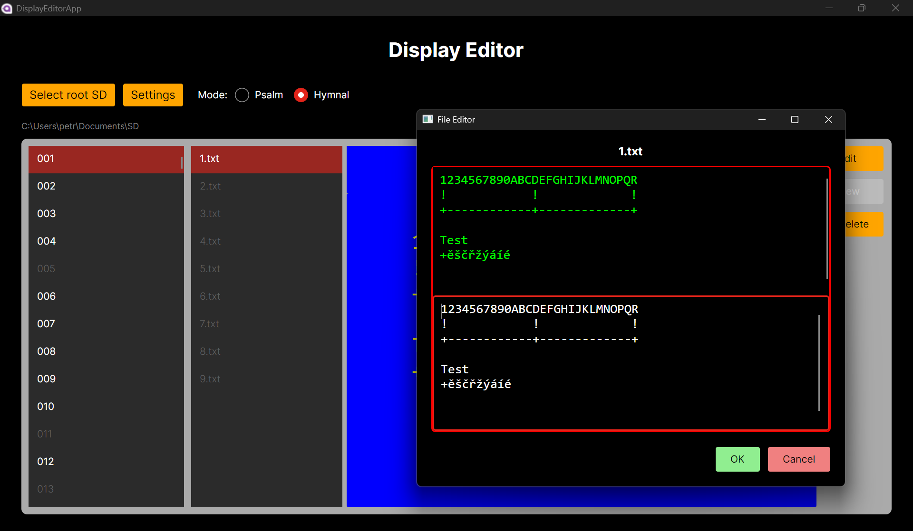
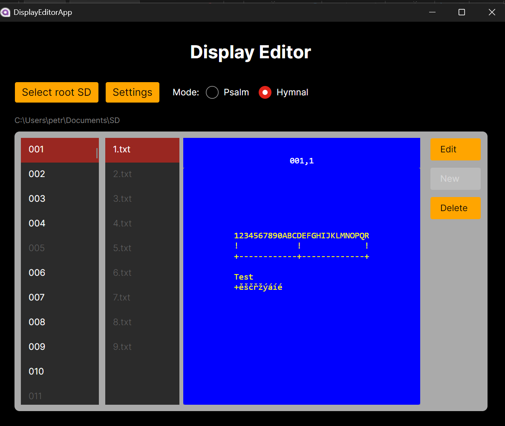

# Church Psalm & Hymn Display 

Editor written in C# and Avalonia framework for editing data for display from project https://github.com/xventus/Church-psalm-hymn-display . 
Use only for non-commercial purposes !


<p align="center">
  
  
</p>


Here only description in Czech language.
---

## Rychlý start

1. **Select root SD** – vyber pracovní složku (SD karta).  
   - Aplikace pracuje s podadresáři:
     - `zalmy` (pro **Simple** režim),
     - `kancional` (pro **Extended** režim).
       
   Idealáně začít s https://github.com/xventus/Church-psalm-hymn-display/blob/master/SD%20card/SD.zip

2. **Přepnutí režimu**
   - **Simple**: seznam souborů `001.txt … 996.txt` v `zalmy`.
   - **Extended**: vlevo seznam podsložek `001 … 900` v `kancional`, vpravo soubory `1.txt … 9.txt` z vybrané podsložky.

3. **Náhled** – výběrem položky se načte obsah do náhledu s ohledem na limity řádků/sloupců.

---

## Režimy

### Psalm (Simple)
- Pracuje s texty v `zalmy\NNN.txt`.
- Import/Export CSV je dostupný pouze v tomto režimu.

### Hymnal (Extended)
- Vlevo vyběr podsložy (`NNN`), vpravo konkrétní soubor (`1–9`).
- Obsah se načítá po volbě podsložky a souboru.

---

## Editace

- **Otevřít editor**: tlačítko **Edit** (nebo dvojklik na položku).  
- **Editor**:
  - Validace znaků (povolená sada), zvýraznění překročení limitů.
  - **Undo/Redo**: `Ctrl+Z` / `Ctrl+Y`.
  - Po otevření se kurzor nastaví na začátek textu.
- **Uložit**: **OK** – text se uloží v CP1250 s formátováním dle nastavených limitů.  
- **Zavřít bez uložení**: **Cancel**.

---

## Vytváření a mazání

- **New** – vytvoří nový soubor (vytvoří i chybějící složky), inicializuje obsah dle limitů.
- **Delete** – po potvrzení smaže vybraný soubor a aktualizuje seznam.

---

## Import / Export (CSV)

### Export CSV (Simple)
- Vyexportuje existující soubory z `zalmy` do `UTF-8 CSV` ve formátu:
  ```
  Number,Text
  001,"obsah…"
  002,"obsah…"
  ```
- Text je „narovnán“ (bez CR/LF, řízené mezery), uvozovky jsou escapované (`""`).

### Import CSV (Simple)
- Načte `UTF-8 CSV` stejného formátu.
- Pro každý řádek:
  - 1. sloupec → číslo souboru `NNN`,
  - 2. sloupec → **InputFormatter** (normalizace + zalomení do mřížky `cols × rows`),
  - uloží jako `zalmy\NNN.txt` v **CP1250** (přepíše, pokud existuje),
  - aktualizuje seznam.

> **InputFormatter**: převádí text na pevnou mřížku bez CR/LF – každý logický řádek má přesně `cols` znaků (doplněno mezerami) a celkově je `rows × cols` znaků.

---

## Nastavení

- **Limity**:
  - Simple: `MaxColumns`, `MaxRows`
  - Extended: `MaxColumnsExt`, `MaxRowsExt`
- **Kódování souborů**: čtení i zápis v **CP1250** (Windows-1250).
- Změna režimu i složky automaticky přepočítá dostupnost příkazů (New/Edit/Delete/Import/Export) a znovu načte seznamy.

---

## Ovládání klávesnicí

- **Vyhledávání psaním** (type-ahead) – pište a aplikace vybírá první shodu; po pauze se hledání resetuje.
- **Šipky ↑/↓** – pohyb ve vybraném seznamu.
- **Enter** (Extended) – přechod mezi levým (podsložky) a pravým (soubory) listem.
- **Escape** – vyčistí rozpracované vyhledávání.
- **Editor**: `Ctrl+Z` / `Ctrl+Y`, `Enter` má řízené chování dle formátovacích pravidel.

---

## Kompatibilita znaků

- Aplikace validuje povolenou sadu znaků (včetně české diakritiky).

---

## Tipy

- Po **Open Folder** v Simple režimu můžete rovnou psát – aplikace předá fokus, nebo použije interní „sink“, takže není nutné kliknout do listu.
- Pokud se změní limity řádků/sloupců, doporučujeme znovu otevřít editor/obnovit náhled, aby se přepočetla vizualizace textu (pouze pro jiné nastavení displejů).

---

## Známé zkratky v UI

- **Open Folder** – výběr pracovní složky (root SD).
- **Simple / Extended** – přepnout režim práce.
- **New / Edit / Delete** – správa souborů.
- **Export / Import** – CSV operace (Simple).
